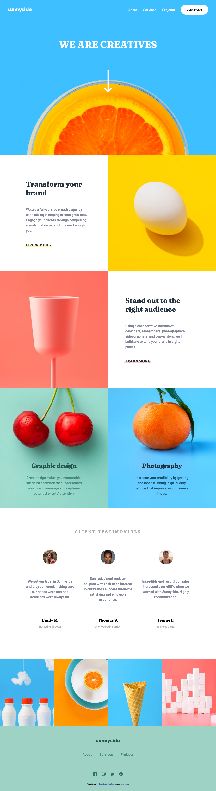

# Frontend Mentor - Sunnyside agency landing page solution

This is a solution to the [Sunnyside agency landing page challenge on Frontend Mentor](https://www.frontendmentor.io/challenges/sunnyside-agency-landing-page-7yVs3B6ef). Frontend Mentor challenges help you improve your coding skills by building realistic projects.

## Table of contents

- [Overview](#overview)
  - [The challenge](#the-challenge)
  - [Screenshot](#screenshot)
  - [Links](#links)
- [My process](#my-process)
  - [Built with](#built-with)
  - [What I learned](#what-i-learned)
  - [Continued development](#continued-development)
  - [Useful resources](#useful-resources)
- [Author](#author)

**Note: Delete this note and update the table of contents based on what sections you keep.**

## Overview

### The challenge

Users should be able to:

- View the optimal layout for the site depending on their device's screen size
- See hover states for all interactive elements on the page

### Screenshot

### Links

- Solution URL: [Add solution URL here](https://your-solution-url.com)
- Live Site URL: [Add live site URL here](https://your-live-site-url.com)

## My process

### Built with

- Semantic HTML5 markup
- CSS custom properties
- Flexbox
- JavaScript

**Note: These are just examples. Delete this note and replace the list above with your own choices**

### What I learned
Helped me improve my css skills.

### Continued development

Could not get the message bubble like corner in the mobile menu to work properly. So i had it not done at all. Perhaps i will give it a try in the future

### Useful resources

- [Stack Overflow](https://stackoverflow.com) - This helped me a lot.
- [MDN](https://developer.mozilla.org/en-US/) - Arguably one of the best resourcs out there

## Author

- GitHub - [Musa](https://github.com/its-me-musa)
- Frontend Mentor - [@its-me-musa](https://www.frontendmentor.io/profile/its-me-musa)